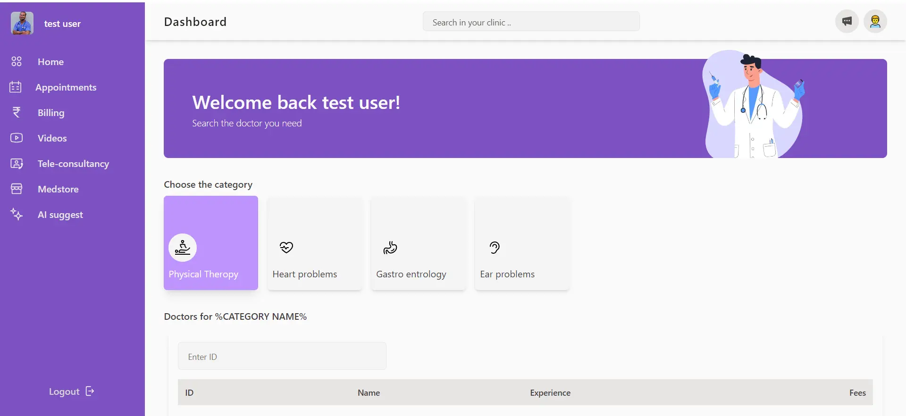

# Doctero-A React app to helps you track doctor and Patient activities.

## Live Demo

Check out the live demo of the project [here](https://main.d13shu2fa3llxr.amplifyapp.com/).

## Description

The Doctor and Patient Dashboard is a web application designed to facilitate communication and information exchange between healthcare providers (doctors) and patients. The platform aims to streamline appointment scheduling, medical record access, and overall patient care management.

**Features**

- **User Authentication:** Secure user authentication for both doctors and patients.
- **Appointment Management:** Schedule, view, and manage appointments efficiently.
- **Medical Records:** Access and update patient medical records securely.
- **Messaging System:** Enable communication between doctors and patients through a secure messaging system.
- **Dashboard Interface:** Intuitive dashboard interfaces for both doctors and patients.

## Technologies Used

**Frontend**

- **HTML**
- **CSS**
- **JavaScript**
- **React.js**

**Backend**

- **Node.js**
- **Express.js**
- **MongoDB**
- **Authentication JWT (JSON Web Tokens)**

## Homepage:

